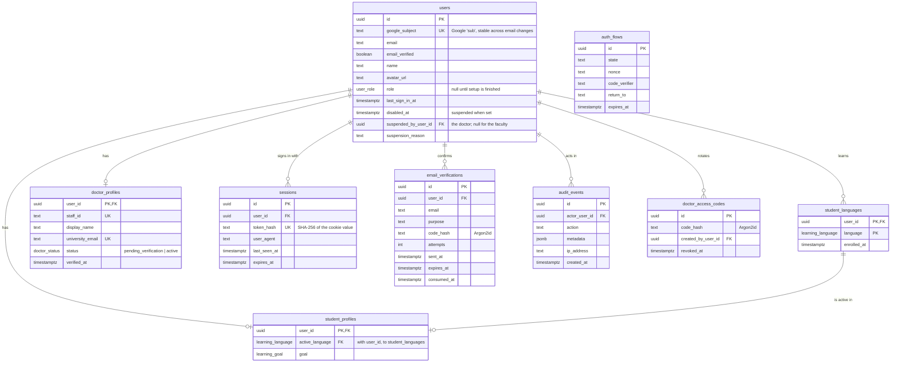
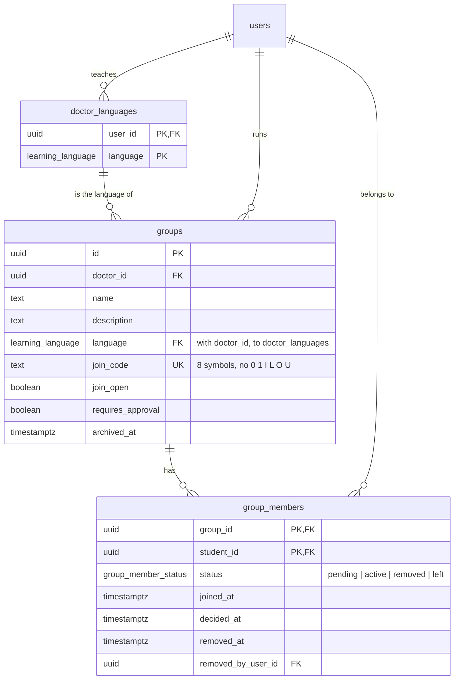
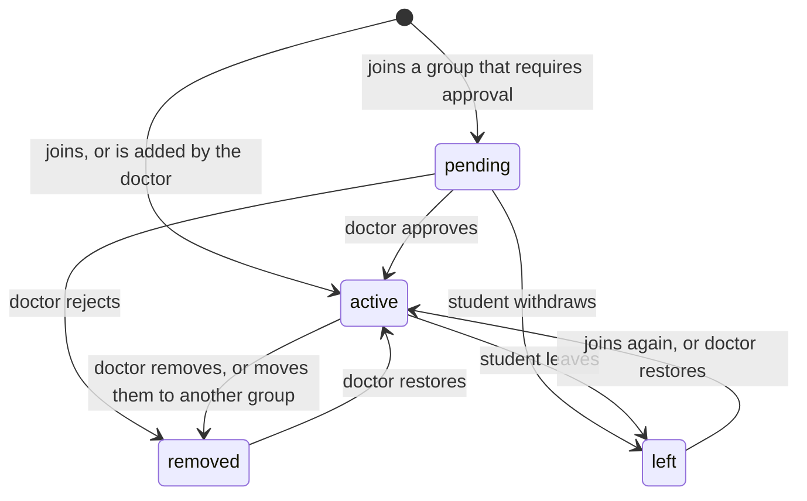
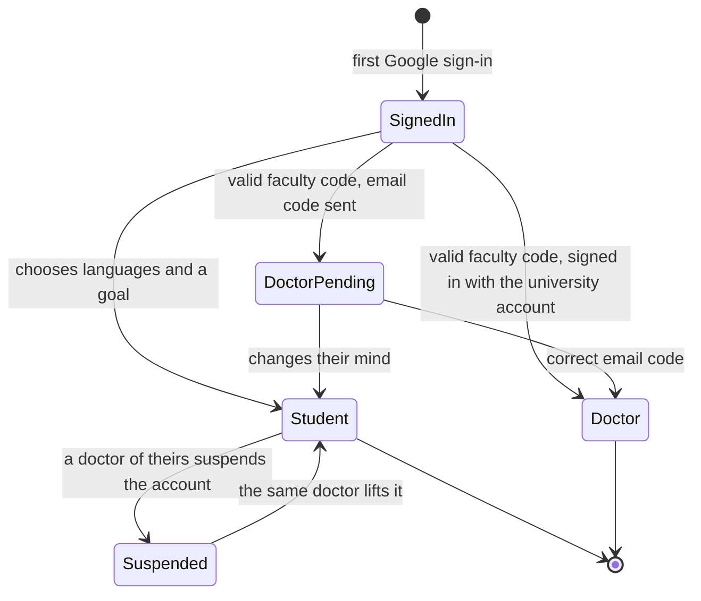

# Data model

PostgreSQL, accessed through Drizzle ORM. The schema lives in `apps/api/src/db/schema.ts` and
every change ships as a reviewed SQL migration in `apps/api/drizzle/`.

## Accounts



`auth_flows` has no relation: it holds a sign-in that is on its way to Google and back, before
any account is known.

## Rules the schema enforces

| Rule                                          | How                                                                      |
| --------------------------------------------- | ------------------------------------------------------------------------ |
| One account per Google identity               | Unique `users.google_subject`                                            |
| One account per doctor                        | Unique `doctor_profiles.staff_id` and `university_email`                 |
| A person is a student or a doctor, never both | Setting up either role removes the other profile in the same transaction |
| A student studies one of their own languages  | Composite key `(user_id, active_language)` to `student_languages`        |
| A language is added once per student          | Primary key `(user_id, language)` on `student_languages`                 |
| Deleting a user removes their data            | `ON DELETE CASCADE` on profiles, languages, groups and sessions          |
| Audit history survives account deletion       | `ON DELETE SET NULL` on `audit_events.actor_user_id`                     |

## What is never stored in clear

| Secret                  | Stored as                                 |
| ----------------------- | ----------------------------------------- |
| Session token           | SHA-256 hash (the cookie holds the token) |
| Doctor access code      | Argon2id hash                             |
| Email confirmation code | Argon2id hash                             |

A copy of the database therefore gives no usable sessions or codes.

## Groups



A doctor teaches one or more languages, and each group is in one of them. Students join a group
with its code, or the doctor adds them by the email they sign in with. Membership rows are never
deleted: a removed student stays visible to the doctor, who can bring them back.

| Rule                                            | How                                                               |
| ----------------------------------------------- | ----------------------------------------------------------------- |
| A group is in a language its doctor teaches     | Composite key `(doctor_id, language)` to `doctor_languages`       |
| A taught language with groups cannot be dropped | The same key; the API answers `LANGUAGE_IN_USE`                   |
| A student keeps the languages of their groups   | Removing one answers `LANGUAGE_IN_USE` while the membership lasts |
| A removed student cannot rejoin with the code   | Joining is refused with `REMOVED_FROM_GROUP`                      |
| A doctor sees and acts on their own groups only | Every query filters on `doctor_id`; anything else is a 404        |
| Join codes cannot be guessed                    | 30^8 codes, 10 wrong codes per student and hour, all audited      |

### Membership



Joining adds the group's language to the student's languages without changing the active one.

### Suspension

A doctor may suspend the account of a student who is, or was, in one of their groups, with a
reason. The student is signed out everywhere and cannot sign in. Only that doctor, or the faculty
administration, lifts it; the student's other doctors see who suspended the account and why.

### Endpoints

| Request                                                    | Who     | Effect                                       |
| ---------------------------------------------------------- | ------- | -------------------------------------------- |
| `PUT /api/doctor/languages`                                | doctor  | Replaces the languages taught                |
| `GET, POST /api/doctor/groups`                             | doctor  | Lists or creates groups                      |
| `PATCH /api/doctor/groups/:id`                             | doctor  | Name, description, joining open, approval    |
| `POST /api/doctor/groups/:id/code`                         | doctor  | A new join code; the old one stops at once   |
| `POST /api/doctor/groups/:id/archive`, `/restore`          | doctor  | Read-only while archived                     |
| `GET, POST /api/doctor/groups/:id/members`                 | doctor  | Lists members, or adds a student by email    |
| `POST /api/doctor/groups/:id/members/:student/:action`     | doctor  | `approve`, `reject`, `remove` or `restore`   |
| `POST /api/doctor/groups/:id/members/:student/move`        | doctor  | To another of the doctor's groups            |
| `POST /api/doctor/students/:student/suspend`, `/unsuspend` | doctor  | Suspends the account, or lifts it            |
| `POST /api/student/join/preview`, `/join`                  | student | Shows the group behind a code, then joins it |
| `GET /api/student/groups`                                  | student | The student's groups and pending requests    |
| `POST /api/student/groups/:id/leave`                       | student | Leaves, or withdraws a request               |

Join codes travel in request bodies, not in API URLs, so they stay out of server logs.

## Account states



## Student languages

A student learns one or more of the six languages and studies one at a time. The active
language lives on `student_profiles`; everything that belongs to one language (level, placement
results, progress) will hang off `student_languages`.

| Request                               | Effect                                                     |
| ------------------------------------- | ---------------------------------------------------------- |
| `POST /api/student/languages`         | Adds a language and makes it active                        |
| `PUT /api/student/active-language`    | Switches to a language the student already has             |
| `DELETE /api/student/languages/:code` | Removes a language; the first remaining one becomes active |

Each answers with the updated account. The last language cannot be removed
(`LAST_LANGUAGE`), and a language that is active cannot be deleted from under the profile: the
foreign key refuses it, so the service moves the profile first. Every change locks the
student's profile row (`SELECT ... FOR UPDATE`), so two requests from the same student, from two
tabs or a double click, cannot both pass a check such as "not the last language".

## Working with migrations

```bash
pnpm --filter @acu/api db:generate
pnpm --filter @acu/api db:migrate
```

The first command writes a new SQL file from the schema; review it before committing. In
development the API applies pending migrations at start-up; in production run the second command
as a deploy step.

A change that moves existing data (a rename, a column that becomes a table) is written by hand,
because the generator cannot know where the rows should go. Keep the snapshot in
`drizzle/meta/` in step with the schema: `drizzle-kit generate` must then report no changes and
`drizzle-kit check` must pass. `src/db/migrations.test.ts` upgrades a database that already holds
rows, one migration at a time, the way a deployed database is upgraded; add a case there for
every migration that moves data.
