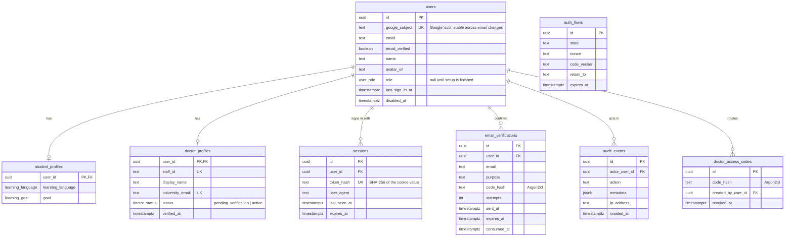
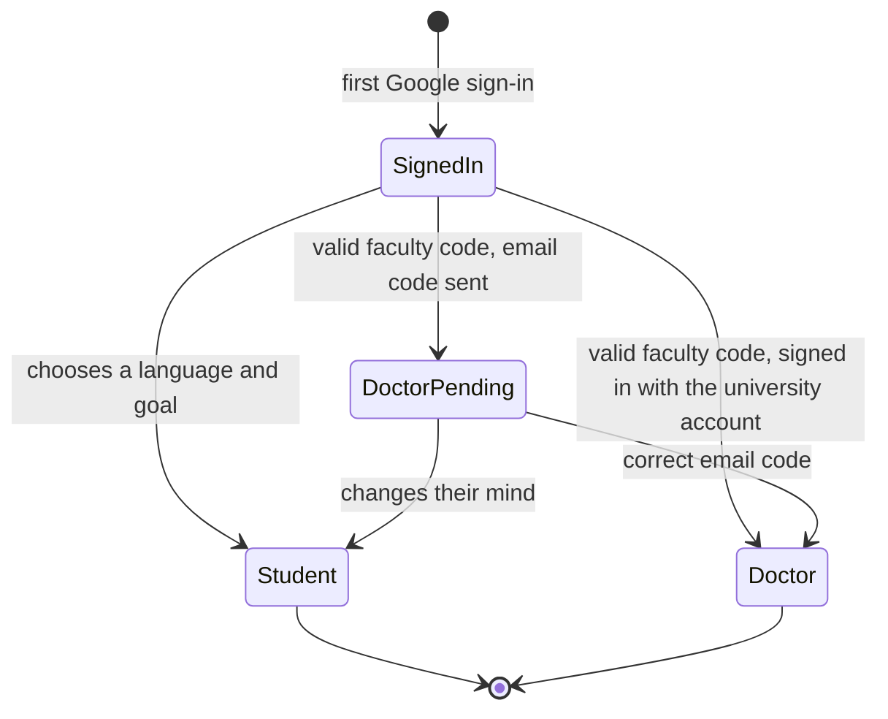

# Data model

PostgreSQL, accessed through Drizzle ORM. The schema lives in `apps/api/src/db/schema.ts` and
every change ships as a reviewed SQL migration in `apps/api/drizzle/`.

## Accounts



`auth_flows` has no relation: it holds a sign-in that is on its way to Google and back, before
any account is known.

## Rules the schema enforces

| Rule                                          | How                                                                      |
| --------------------------------------------- | ------------------------------------------------------------------------ |
| One account per Google identity               | Unique `users.google_subject`                                            |
| One account per doctor                        | Unique `doctor_profiles.staff_id` and `university_email`                 |
| A person is a student or a doctor, never both | Setting up either role removes the other profile in the same transaction |
| Deleting a user removes their data            | `ON DELETE CASCADE` on profiles, sessions and email codes                |
| Audit history survives account deletion       | `ON DELETE SET NULL` on `audit_events.actor_user_id`                     |

## What is never stored in clear

| Secret                  | Stored as                                 |
| ----------------------- | ----------------------------------------- |
| Session token           | SHA-256 hash (the cookie holds the token) |
| Doctor access code      | Argon2id hash                             |
| Email confirmation code | Argon2id hash                             |

A copy of the database therefore gives no usable sessions or codes.

## Account states



## Working with migrations

```bash
pnpm --filter @acu/api db:generate
pnpm --filter @acu/api db:migrate
```

The first command writes a new SQL file from the schema; review it before committing. In
development the API applies pending migrations at start-up; in production run the second command
as a deploy step.
