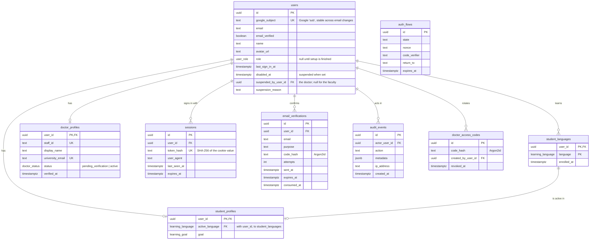
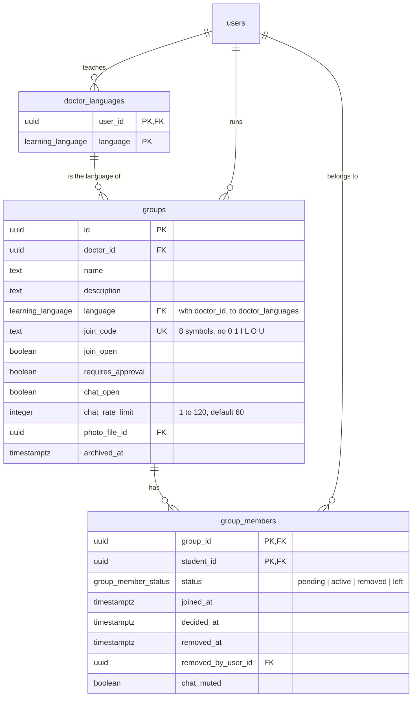
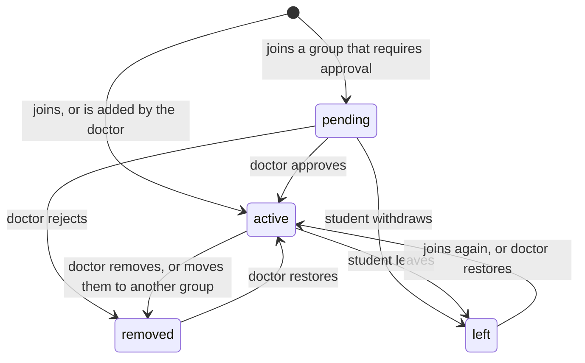
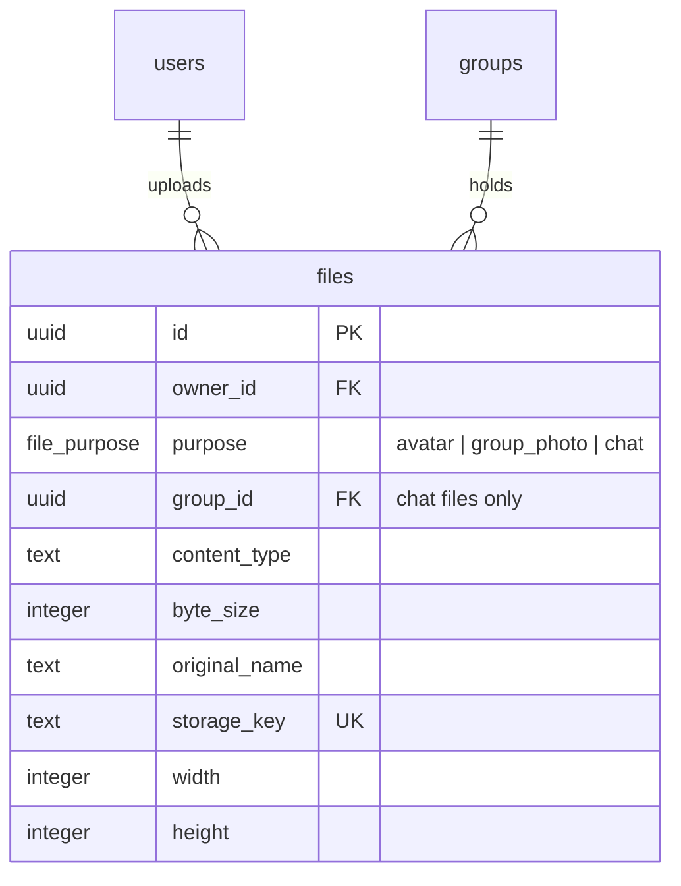
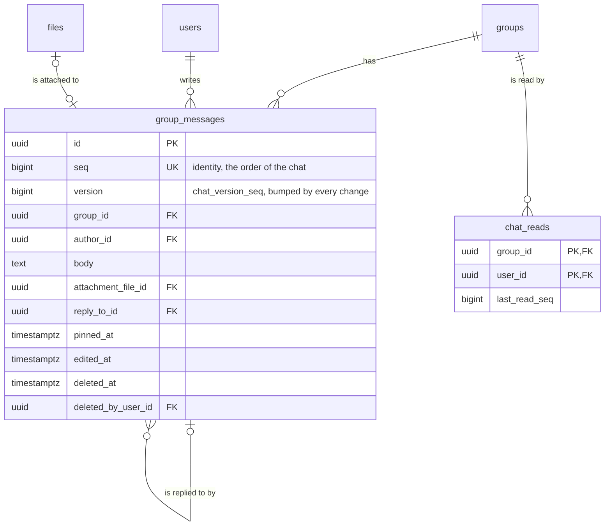
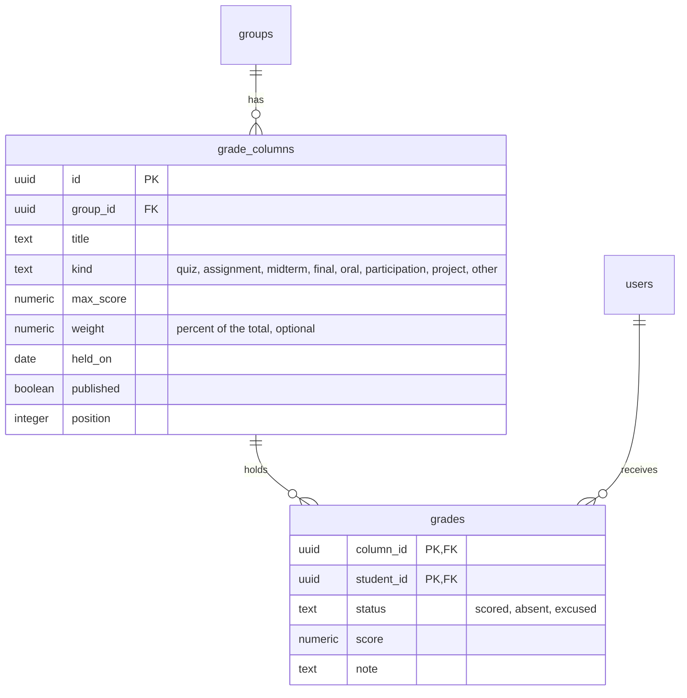
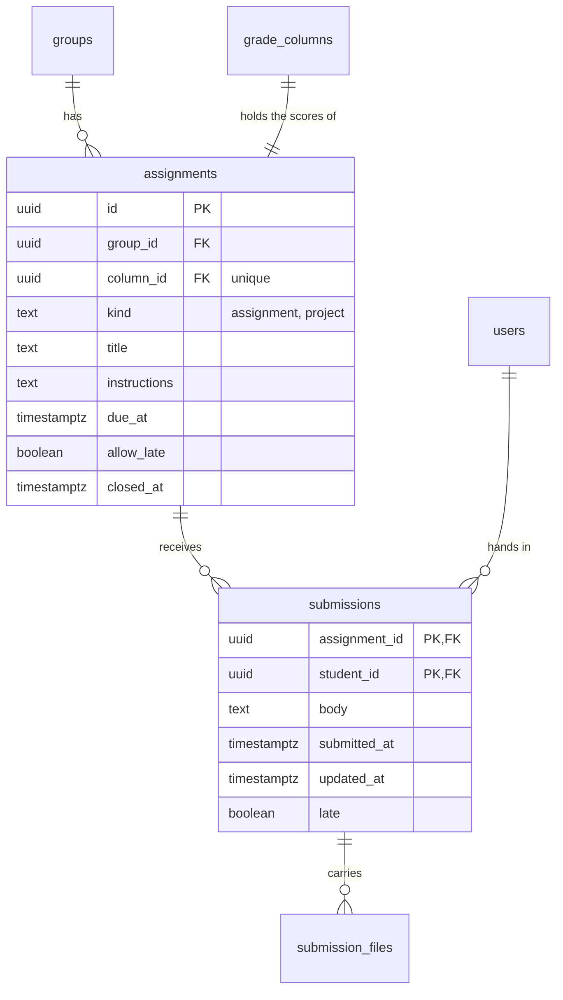
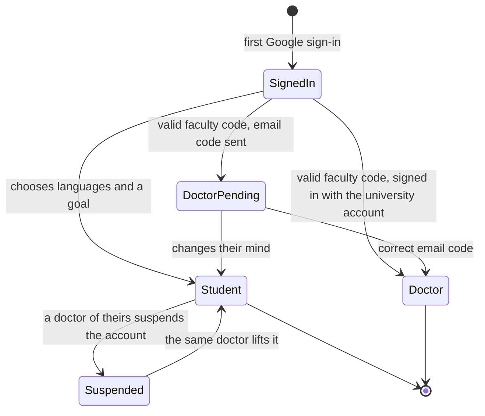

# Data model

PostgreSQL, accessed through Drizzle ORM. The schema lives in `apps/api/src/db/schema.ts` and
every change ships as a reviewed SQL migration in `apps/api/drizzle/`.

## Accounts



`auth_flows` has no relation: it holds a sign-in that is on its way to Google and back, before
any account is known.

## Rules the schema enforces

| Rule                                          | How                                                                      |
| --------------------------------------------- | ------------------------------------------------------------------------ |
| One account per Google identity               | Unique `users.google_subject`                                            |
| One account per doctor                        | Unique `doctor_profiles.staff_id` and `university_email`                 |
| A person is a student or a doctor, never both | Setting up either role removes the other profile in the same transaction |
| A student studies one of their own languages  | Composite key `(user_id, active_language)` to `student_languages`        |
| A language is added once per student          | Primary key `(user_id, language)` on `student_languages`                 |
| Deleting a user removes their data            | `ON DELETE CASCADE` on profiles, languages, groups and sessions          |
| Audit history survives account deletion       | `ON DELETE SET NULL` on `audit_events.actor_user_id`                     |

## What is never stored in clear

| Secret                  | Stored as                                 |
| ----------------------- | ----------------------------------------- |
| Session token           | SHA-256 hash (the cookie holds the token) |
| Doctor access code      | Argon2id hash                             |
| Email confirmation code | Argon2id hash                             |

A copy of the database therefore gives no usable sessions or codes.

## Groups



A doctor teaches one or more languages, and each group is in one of them. Students join a group
with its code, or the doctor adds them by the email they sign in with. Membership rows are never
deleted: a removed student stays visible to the doctor, who can bring them back.

| Rule                                            | How                                                               |
| ----------------------------------------------- | ----------------------------------------------------------------- |
| A group is in a language its doctor teaches     | Composite key `(doctor_id, language)` to `doctor_languages`       |
| A taught language with groups cannot be dropped | The same key; the API answers `LANGUAGE_IN_USE`                   |
| A student keeps the languages of their groups   | Removing one answers `LANGUAGE_IN_USE` while the membership lasts |
| A removed student cannot rejoin with the code   | Joining is refused with `REMOVED_FROM_GROUP`                      |
| A doctor sees and acts on their own groups only | Every query filters on `doctor_id`; anything else is a 404        |
| Join codes cannot be guessed                    | 30^8 codes, 10 wrong codes per student and hour, all audited      |

### Membership



Joining adds the group's language to the student's languages without changing the active one.

### Suspension

A doctor may suspend the account of a student who is, or was, in one of their groups, with a
reason. The student is signed out everywhere and cannot sign in. Only that doctor, or the faculty
administration, lifts it; the student's other doctors see who suspended the account and why.

### Endpoints

| Request                                                    | Who     | Effect                                       |
| ---------------------------------------------------------- | ------- | -------------------------------------------- |
| `PUT /api/doctor/languages`                                | doctor  | Replaces the languages taught                |
| `GET, POST /api/doctor/groups`                             | doctor  | Lists or creates groups                      |
| `PATCH /api/doctor/groups/:id`                             | doctor  | Name, description, joining, approval, chat   |
| `PUT, DELETE /api/doctor/groups/:id/photo`                 | doctor  | Sets or removes the group's photo            |
| `POST /api/doctor/groups/:id/code`                         | doctor  | A new join code; the old one stops at once   |
| `POST /api/doctor/groups/:id/archive`, `/restore`          | doctor  | Read-only while archived                     |
| `GET, POST /api/doctor/groups/:id/members`                 | doctor  | Lists members, or adds a student by email    |
| `POST /api/doctor/groups/:id/members/:student/:action`     | doctor  | `approve`, `reject`, `remove` or `restore`   |
| `POST /api/doctor/groups/:id/members/:student/move`        | doctor  | To another of the doctor's groups            |
| `POST /api/doctor/groups/:id/members/:student/chat-mute`   | doctor  | Mutes or unmutes a student in the chat       |
| `POST /api/doctor/students/:student/suspend`, `/unsuspend` | doctor  | Suspends the account, or lifts it            |
| `POST /api/student/join/preview`, `/join`                  | student | Shows the group behind a code, then joins it |
| `GET /api/student/groups`                                  | student | The student's groups and pending requests    |
| `POST /api/student/groups/:id/leave`                       | student | Leaves, or withdraws a request               |

Join codes travel in request bodies, not in API URLs, so they stay out of server logs.

## Files



Uploads go through one path, whatever they are for:

1. The type is read from the file's first bytes; the name and the type the browser claims are
   not trusted.
2. Images are decoded and written again as WebP, turned upright, resized and stripped of their
   metadata (camera, location). Profile photos become 256 px squares, group photos 512 px
   squares, chat images at most 1600 px on their long side.
3. Documents (PDF, Word, PowerPoint, Excel) and audio are kept as sent.

| Purpose       | Largest | Who can read it                           |
| ------------- | ------- | ----------------------------------------- |
| `avatar`      | 5 MB    | Anyone signed in                          |
| `group_photo` | 5 MB    | Anyone signed in                          |
| `chat`        | 10 MB   | The group's doctor and its active members |

`GET /api/files/:id` serves a file with `X-Content-Type-Options: nosniff`, a sandboxing
`Content-Security-Policy`, and `Content-Disposition: attachment` for everything but images and
audio, so an uploaded file never runs as a page of the platform. A file that is replaced or whose
message is deleted is removed from storage.

Files live on disk under `UPLOADS_DIR` (`.data/uploads` by default) behind a small storage
interface; production swaps in an object store driver without touching the services.

`PUT /api/me/avatar` sets a person's own photo and `DELETE` goes back to the Google picture.

## Group chat



Every group has one chat, shared by its doctor and its active members.

| Rule                                      | How                                                                                                                              |
| ----------------------------------------- | -------------------------------------------------------------------------------------------------------------------------------- |
| The doctor can close the chat to students | `groups.chat_open`, a weekly schedule, or by hand over it; students then read only (`CHAT_CLOSED`)                               |
| The doctor can mute one student           | `group_members.chat_muted` (`CHAT_MUTED`)                                                                                        |
| An archived group's chat is read-only     | Writing answers `GROUP_ARCHIVED`                                                                                                 |
| Only the author edits a message           | Text messages only (`MESSAGE_NOT_EDITABLE`)                                                                                      |
| The author or the staff delete it         | The row stays as a placeholder; the attachment is removed. See the roles below                                                   |
| The staff and moderators pin              | `pinned_at`; a deleted message is unpinned                                                                                       |
| No flooding                               | Each doctor sets the messages per student and minute (1-120, 60 by default); the doctor's own limit is 120 (`CHAT_RATE_LIMITED`) |

Deleting someone else's message, muting and unmuting are written to the audit log.

Clients load the latest 50 messages, older pages with `?before=<seq>`, then ask every few
seconds for what changed with `?since=<version>`. Every insert, edit, deletion or pin takes a new
value from `chat_version_seq`, so a single query returns new and changed messages alike, and a
client never misses an edit made to an old message. Unread counts compare `seq` with
`chat_reads.last_read_seq`.

| Request                                            | Effect                                            |
| -------------------------------------------------- | ------------------------------------------------- |
| `GET /api/groups/:id`                              | The group as this person sees it, with chat state |
| `GET /api/groups/:id/chat`                         | The latest page, or `?before=<seq>`               |
| `GET /api/groups/:id/chat/changes?since=<n>`       | Messages created or changed since a version       |
| `POST /api/groups/:id/chat`                        | Sends text, a file, or both (multipart)           |
| `PATCH, DELETE /api/groups/:id/chat/:message`      | Edits or deletes a message                        |
| `POST /api/groups/:id/chat/:message/pin`, `/unpin` | Pins or unpins (staff and moderators)             |
| `POST /api/groups/:id/chat/read`                   | Marks the chat read up to a message               |

Anyone outside the group gets a 404 for all of these, as for the doctor routes.

## Roles in a group

A group has one owner, the doctor who created it. Everyone else holds one of four roles, and each
role is a fixed set of capabilities (`packages/shared/src/contracts/roles.ts`). The server works
out the reader's role once per request (`groupAccess`) and every route asks for the capability it
needs, so the web client and the API can never disagree about who may do what.

| Capability                          | Owner | Assistant | Moderator | Representative | Student |
| ----------------------------------- | :---: | :-------: | :-------: | :------------: | :-----: |
| Write while the chat is closed      |  yes  |    yes    |    yes    |      yes       |         |
| Pin and unpin messages              |  yes  |    yes    |    yes    |                |         |
| Delete other people's messages      |  yes  |    yes    | students  |                |         |
| Publish announcements               |  yes  |    yes    |           |      yes       |         |
| Create polls                        |  yes  |    yes    |    yes    |      yes       |         |
| Mention the whole group             |  yes  |    yes    |    yes    |      yes       |         |
| Mute a student in the chat          |  yes  |    yes    |           |                |         |
| Gradebook, activity and exports     |  yes  |    yes    |           |                |         |
| Members, settings, code, assistants |  yes  |           |           |                |         |

Assistants are doctor accounts listed in `group_assistants`; moderators and representatives are
students, marked in `group_members.role`. A moderator deletes messages written by students and
representatives only, never those of the staff or of another moderator. Role changes are written
to the audit log and the person is notified.

| Request                                             | Effect                              |
| --------------------------------------------------- | ----------------------------------- |
| `POST /api/doctor/groups/:id/members/:student/role` | Sets a student's role               |
| `GET, POST /api/doctor/groups/:id/assistants`       | Lists assistants, adds one by email |
| `DELETE /api/doctor/groups/:id/assistants/:doctor`  | Removes an assistant                |
| `GET /api/doctor/assisting`                         | The groups a doctor assists in      |

## When the chat is open

`groups.chat_schedule` holds weekly time slots (`{ day, start, end }`, day 0 is Sunday) read in
`Africa/Cairo`, including across daylight-saving changes. Without a schedule, `groups.chat_open`
decides. With one, the doctor can still open or close the chat by hand: the choice is stored in
`chat_override_open` with `chat_override_until` set to the schedule's next change, after which the
schedule takes over again. Choosing what the schedule already says clears the override, and so
does saving a new schedule. The group view reports `mode`, `manual` and `nextChange`, so the
client shows "open until" or "opens at" without knowing the rules.

## Mentions, polls and announcements

A message names people as `@[uuid]` and everyone as `@[all]`. On write the server drops tokens for
people outside the group, and `@[all]` from a writer without that capability; the surviving ids
are stored in `group_messages.mentions` and `mentions_all`, and each person named is notified.

A poll belongs to one chat message (`polls.message_id` is unique) with its `poll_options` and
`poll_votes`. It may allow several choices, hide who voted, and close at a set time or when its
author or the staff close it (`POLL_CLOSED` afterwards). A vote bumps the message's version, so
the chat's change feed carries the new counts to everyone.

Announcements live outside the chat: `announcements` with up to five files in
`announcement_attachments`, and one row per reader in `announcement_reads`. The staff and the
author see who read each one; the audience is the group's active students.

| Request                                             | Effect                                      |
| --------------------------------------------------- | ------------------------------------------- |
| `POST /api/groups/:id/polls`                        | Posts a poll as a chat message              |
| `POST /api/groups/:id/polls/:poll/vote`, `/close`   | Votes (or withdraws a vote), closes it      |
| `GET, POST /api/groups/:id/announcements`           | Lists, publishes (multipart)                |
| `PATCH, DELETE /api/groups/:id/announcements/:item` | Edits or removes one                        |
| `POST /api/groups/:id/announcements/read`           | Marks announcements read                    |
| `GET /api/groups/:id/announcements/:item/receipts`  | Who read it and who has not                 |
| `GET /api/groups/:id/files?kind=&q=&before=`        | Everything shared, by kind, with the counts |

Files are sorted into images, video, audio and documents. Video is recognised by its container
(MP4, WebM, QuickTime) and may be up to 25 MB; everything else up to 10 MB.

## Gradebook and exports



A column is one quiz or task; a grade is one student's cell in it. An absent student counts as
zero and an excused one is left out of their total; `totalPercent` in the shared package is the
single definition of the total, and `bandOf` turns it into excellent (85), very good (75), good
(65), pass (50) or fail. A student sees only the columns marked `published`, with their own score,
the note and the class average. `student_profiles.university_id` is optional and appears on the
sheets.

The same query feeds the activity view: messages, last message, last visit, announcements read,
polls answered and files shared for each student, with `quiet` (no message in seven days) and
`away` (no visit in seven days; a message counts as a visit).

| Request                                                 | Effect                                          |
| ------------------------------------------------------- | ----------------------------------------------- |
| `GET /api/groups/:id/gradebook`                         | Columns, students, grades and activity          |
| `POST, PATCH, DELETE /api/groups/:id/gradebook/columns` | Manages columns; `PUT .../gradebook/order`      |
| `PUT /api/groups/:id/gradebook/columns/:column/grades`  | Saves one or many cells                         |
| `GET /api/groups/:id/my-grades`                         | A student's own published grades                |
| `PUT /api/me/university-id`                             | A student's university number                   |
| `GET /api/groups/:id/export?report=&lang=`              | An Excel workbook for one group                 |
| `GET /api/doctor/export?lang=`                          | One workbook covering every group a doctor owns |

Exports are built with exceljs in Arabic (right to left) or English. `grades` is the official
sheet: no emails, with lines for the signature and the stamp. `full` adds a summary, activity,
announcements, polls and members; `activity` leaves the grades out. Averages, maxima and minima
are live formulas, so the sheet stays correct if a score is corrected in Excel.

## Assignments



An assignment is work students hand in on the platform. Creating one creates a gradebook column
(`grade_columns.source = 'assignment'`) in the same transaction, and grading a submission writes
into that column through the gradebook's own `setGrades`. A score is therefore stored once: the
gradebook, a student's grades and every export read the same row. The column starts hidden;
"releasing" the grades publishes it and notifies the students. Deleting the column from the
gradebook is refused (`COLUMN_HAS_ASSIGNMENT`), because it would take the handed-in work with it;
deleting the assignment removes both, after a confirmation that says so.

| Rule                                      | How                                                                |
| ----------------------------------------- | ------------------------------------------------------------------ |
| Only the staff create, change and grade   | The `teach` capability                                             |
| A student hands in text, files, or both   | Up to five files; an empty submission is refused                   |
| Work can be replaced or withdrawn         | Until it is graded (`SUBMISSION_LOCKED`) or closed                 |
| A deadline may accept late work           | `allow_late`; late work is flagged. Otherwise `ASSIGNMENT_CLOSED`  |
| The staff can close an assignment by hand | `closed_at`, whatever the deadline says                            |
| Handed-in files are private               | File purpose `submission`: readable by their student and the staff |
| A student sees their score once released  | `grade_columns.published`                                          |

| Request                                                            | Effect                                          |
| ------------------------------------------------------------------ | ----------------------------------------------- |
| `GET, POST /api/groups/:id/assignments`                            | Lists; creates (multipart: `data` JSON + files) |
| `GET /api/groups/:id/assignments/:item`                            | Staff: every student with what they handed in   |
| `PATCH, DELETE /api/groups/:id/assignments/:item`                  | Changes, closes, releases; deletes              |
| `PUT, DELETE /api/groups/:id/assignments/:item/submission`         | A student hands in, replaces or withdraws       |
| `PUT /api/groups/:id/assignments/:item/submissions/:student/grade` | Grades one student's work                       |

## Reactions, search and reminders

`message_reactions` holds one reaction per person and message: a single emoji, checked on the
server as one grapheme. Reacting again replaces it, and `null` takes it back. Each change bumps the
message's version, so the counts reach everyone through the chat's change feed. On a message from
the staff, two reactions are offered to students by name ("got it", "needs explaining"), which
gives the doctor a quick reading of the room without a new kind of data.

`GET /api/groups/:id/chat/search` finds messages by words in their text or in an attached file's
name, optionally narrowed to the staff's messages, pinned ones, those mentioning the reader, or
those with a file. LIKE wildcards in the query are escaped.

`POST /api/groups/:id/nudges` lets the staff remind students: the inactive, those who have not
read an announcement, or those who have not handed in an assignment. A reminder is an ordinary
notification of kind `nudge` that leads to its subject. A student already reminded in the last 12
hours is skipped, and the answer says how many were.

| Request                                              | Effect                                     |
| ---------------------------------------------------- | ------------------------------------------ |
| `PUT /api/groups/:id/chat/:message/reaction`         | Sets, replaces or removes the reader's own |
| `GET /api/groups/:id/chat/:message/reactions`        | Who reacted, by emoji                      |
| `GET /api/groups/:id/chat/search?q=&filter=&before=` | Matching messages, newest first            |
| `POST /api/groups/:id/nudges`                        | Reminds students; `{ sent, skipped }`      |

## University numbers

Every student has a university number (`student_profiles.university_id`), asked for at sign-up,
stored trimmed and in capitals, and unique across accounts (`UNIVERSITY_ID_TAKEN`). It can be
corrected in the profile but not cleared. Accounts created before it was required are asked for it
once at their next visit, and cannot join a group without it (`UNIVERSITY_ID_REQUIRED`). The
number is shown to the student and to their doctors only: in the members list, the gradebook, the
grading view and every export. A doctor can also add a student to a group by it.

## Notifications

`notifications` holds what a person should see in the app: a mention, an announcement, a poll, a
published grade, a new assignment, a new role, or a reminder from the staff. `notify()` writes those rows and, for people who allowed it on a
device, sends a Web Push message through `push_subscriptions`, each in the language that device
was using. `notification_settings` stores which kinds reach the browser; "every message" exists
only as a push and is never stored. Without `VAPID_PUBLIC_KEY` and `VAPID_PRIVATE_KEY` the API
runs with push switched off and everything else works.

| Request                                                          | Effect                                   |
| ---------------------------------------------------------------- | ---------------------------------------- |
| `GET /api/notifications`, `/unread`                              | The latest, and the unread count         |
| `POST /api/notifications/read`                                   | Marks some or all read                   |
| `GET, PUT /api/notifications/settings`                           | What reaches the browser                 |
| `GET /api/notifications/push-key`                                | The public key a browser subscribes with |
| `POST /api/notifications/subscriptions`, `/subscriptions/remove` | Adds or removes this device              |

## People

Everyone in a group sees who else is in it, and can open their profile.

| Request                      | Effect                                                    |
| ---------------------------- | --------------------------------------------------------- |
| `GET /api/groups/:id/people` | The doctor, then the active students by name              |
| `GET /api/people/:id`        | A profile: name, photo, role, languages, groups in common |

A profile is visible to people who share an active group with its owner, and to a doctor for any
student who is or was in one of their groups; anyone else gets a 404. A student's email is shown
only to their doctors; a doctor's university email to everyone who may see the profile. Waiting,
removed and departed students are not listed to classmates.

## Rate limits

Two limits apply to every API request: a generous one per IP address, since a whole lab shares the
university's address, and one per signed-in person (1500 requests in 15 minutes, enough for an open
chat that polls every five seconds). Sign-in and onboarding have stricter limits of their own.

## Account states



## Student languages

A student learns one or more of the six languages and studies one at a time. The active
language lives on `student_profiles`; everything that belongs to one language (level, placement
results, progress) will hang off `student_languages`.

| Request                               | Effect                                                     |
| ------------------------------------- | ---------------------------------------------------------- |
| `POST /api/student/languages`         | Adds a language and makes it active                        |
| `PUT /api/student/active-language`    | Switches to a language the student already has             |
| `DELETE /api/student/languages/:code` | Removes a language; the first remaining one becomes active |

Each answers with the updated account. The last language cannot be removed
(`LAST_LANGUAGE`), and a language that is active cannot be deleted from under the profile: the
foreign key refuses it, so the service moves the profile first. Every change locks the
student's profile row (`SELECT ... FOR UPDATE`), so two requests from the same student, from two
tabs or a double click, cannot both pass a check such as "not the last language".

## Working with migrations

```bash
pnpm --filter @acu/api db:generate
pnpm --filter @acu/api db:migrate
```

The first command writes a new SQL file from the schema; review it before committing. In
development the API applies pending migrations at start-up; in production run the second command
as a deploy step.

A change that moves existing data (a rename, a column that becomes a table) is written by hand,
because the generator cannot know where the rows should go. Keep the snapshot in
`drizzle/meta/` in step with the schema: `drizzle-kit generate` must then report no changes and
`drizzle-kit check` must pass. `src/db/migrations.test.ts` upgrades a database that already holds
rows, one migration at a time, the way a deployed database is upgraded; add a case there for
every migration that moves data.
