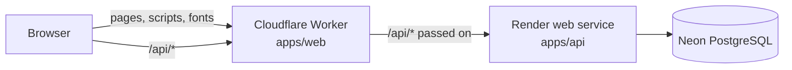

# Deployment

The platform runs on free plans: Cloudflare serves the web app, Render runs the API and Neon
hosts PostgreSQL.



The browser only ever talks to the Cloudflare address. The Worker answers every page from the
built assets and passes `/api` requests to the API, so the session cookie stays first-party and
no CORS is needed. Uploaded photos and attachments are stored in PostgreSQL
(`STORAGE_DRIVER=database`), because the free plan's disk does not survive a restart.

## What the free plans mean

| Part       | Limit that matters                                                           |
| ---------- | ---------------------------------------------------------------------------- |
| Render API | Sleeps after 15 minutes without requests; the first request then takes ~30 s |
| Neon       | 0.5 GB of storage, uploads included                                          |
| Cloudflare | 100,000 Worker requests a day; static files do not count                     |

## First deployment

### 1. Database (Neon)

1. Create a project at [neon.tech](https://neon.tech) in the Frankfurt region.
2. Copy the connection string (`postgresql://…?sslmode=require`). It is a secret: it goes into
   Render only.

### 2. API (Render)

1. At [render.com](https://render.com), choose **New → Blueprint** and pick this repository. Render
   reads `render.yaml` and creates the `acu-languages-api` service.
2. Fill in the values the blueprint asks for:

   | Variable               | Value                                                                      |
   | ---------------------- | -------------------------------------------------------------------------- |
   | `WEB_ORIGIN`           | The Cloudflare address, e.g. `https://acu-languages.<account>.workers.dev` |
   | `DATABASE_URL`         | The Neon connection string                                                 |
   | `GOOGLE_CLIENT_ID`     | From the Google OAuth client                                               |
   | `GOOGLE_CLIENT_SECRET` | From the Google OAuth client                                               |
   | `SMTP_URL`             | e.g. `smtps://name%40gmail.com:<app-password>@smtp.gmail.com:465`          |
   | `MAIL_FROM`            | e.g. `ACU Languages <name@gmail.com>`                                      |

3. Each start applies pending migrations, then starts the server. `/api/health` answers when it
   is up.

### 3. Web app (Cloudflare)

1. Set `API_ORIGIN` in `apps/web/wrangler.jsonc` to the Render service's address.
2. From `apps/web`:

   ```bash
   pnpm wrangler login
   pnpm deploy
   ```

### 4. Google sign-in

In the OAuth client (see [google-sign-in.md](google-sign-in.md)), add the Cloudflare address as an
authorised JavaScript origin and `https://<address>/api/auth/google/callback` as a redirect URI.
To let anyone sign in, not only test users, publish the app under **Audience**; the scopes used
(`openid`, `email`, `profile`) need no review.

### 5. Doctor access code

The faculty code that doctors type is stored as a hash in the database. Set it once from your
machine. `read -rs` takes the Neon connection string without echoing it or keeping it in the shell
history, and the command then asks for the code twice:

```bash
read -rs DATABASE_URL && export DATABASE_URL
pnpm --filter @acu/api doctor-code:set
```

## Later deployments

- **API**: every push to `main` redeploys it.
- **Web app**: run `pnpm deploy` in `apps/web` after merging.

## Security notes

- Static responses carry a Content Security Policy that allows only the platform's own scripts
  and styles, Google profile pictures, and same-origin requests (`apps/web/public/_headers`).
- The API trusts two proxies (`TRUST_PROXY=2`) to read the client's address. That address only
  feeds the generous per-address limit; every signed-in person also has a limit of their own.
- Secrets live in the Render dashboard. None is committed, and `wrangler.jsonc` holds only the
  public API address.
