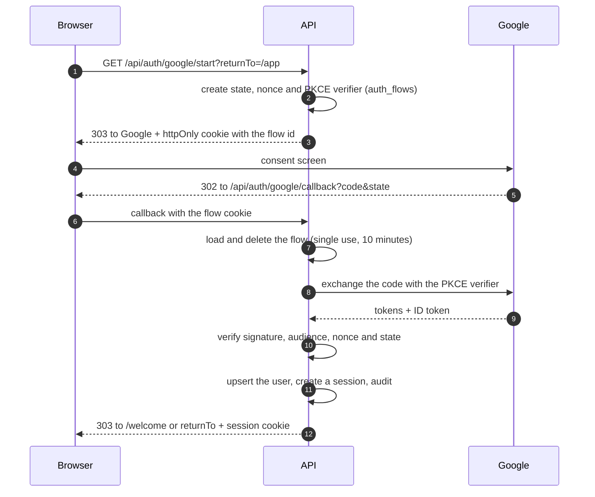

# Google sign-in

The platform has no passwords: everyone signs in with a Google account. The API runs the
OpenID Connect authorisation code flow with PKCE, `state` and `nonce`, using `openid-client`.

## Setting up a Google OAuth client

1. Open the [Google Cloud console](https://console.cloud.google.com/) and create a project, for
   example `ACU Languages`.
2. Go to **Google Auth Platform → Branding** and fill in the app name, a support email and the
   developer contact email.
3. Under **Audience**, choose **External**. While the app is in _Testing_, add every Google
   account that should be able to sign in as a **test user**.
4. Under **Data access**, keep the default scopes `openid`, `email` and `profile`. No sensitive
   scopes are needed.
5. Under **Clients**, create a client of type **Web application** with:

   | Setting                       | Development value                                |
   | ----------------------------- | ------------------------------------------------ |
   | Authorised JavaScript origins | `http://localhost:5173`                          |
   | Authorised redirect URIs      | `http://localhost:5173/api/auth/google/callback` |

   For production, add the HTTPS origin and `https://<domain>/api/auth/google/callback`.

6. Copy the client ID and secret into `apps/api/.env`:

   ```bash
   GOOGLE_CLIENT_ID=...apps.googleusercontent.com
   GOOGLE_CLIENT_SECRET=...
   ```

   `.env` files are ignored by Git. Never commit the secret.

Without these values the API still starts, and the sign-in page explains that Google sign-in is
unavailable.

## How a sign-in works



## Security decisions

- **Only a verified Google email is accepted.**
- **Return paths are sanitised.** Only a path on our own site is followed after sign-in, so the
  flow cannot be used as an open redirect.
- **The session cookie is `HttpOnly`, `SameSite=Lax`, and `Secure` in production**, where it also
  carries the `__Host-` prefix. Scripts cannot read it.
- **Sessions are stored as hashes** and end after 14 days without use or 30 days in total.
- **A new session is issued whenever the account gains a role**, so an earlier token cannot be
  used at the new privilege level.
- **State-changing requests must come from the web app's origin** (checked from `Origin` or
  `Referer`), which protects the cookie against cross-site request forgery.
- **Sign-in and setup requests are rate-limited per IP address.**

## Doctors

Doctors prove their role with two separate facts:

1. **A faculty-wide code**, set by an administrator with
   `pnpm --filter @acu/api doctor-code:set`. Only its Argon2id hash is stored. Five wrong codes in
   an hour lock the doctor path for that account, and each attempt is written to the audit log.
2. **Their university email**: confirmed with a six-digit code (ten minutes, five attempts, a new
   code at most once a minute). If they signed in with that same university Google account,
   Google has already proven ownership and the account is activated immediately.

The first administrator is created with `pnpm --filter @acu/api admin:grant <email>` after that
person has signed in once.
